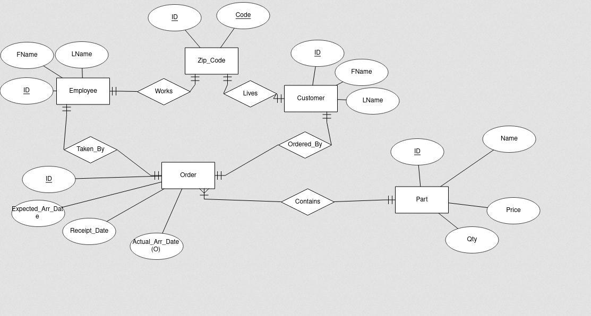
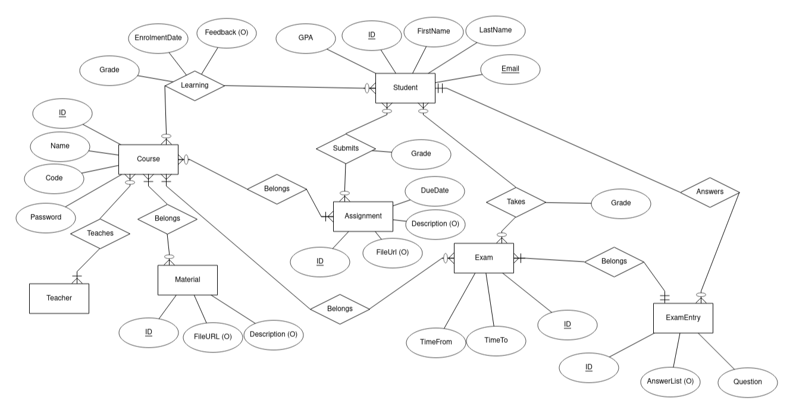

# ICA_0005

Database Basics course, written for MySQL using MySQL workbench.

## Assignment 2
ERM for one of the models from the second assignment, as png

## Assignment 3-4
Queries made on "MiniInsta" database provided by the lecturer. All the relevant .sql files for the database are included

## Assignment 5

Project "MiniMoodle" - lightweight analog of Moodle used by TalTech.

Assignment_5.sql and playground.sql include sample queries to test the database out.
